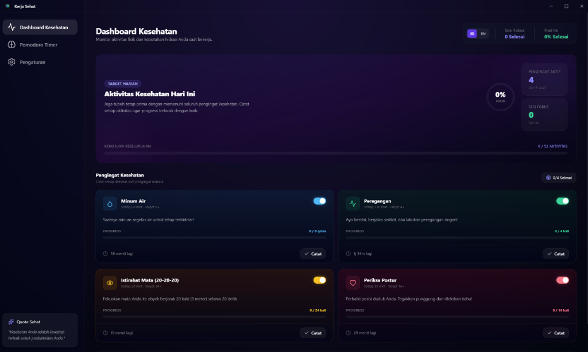

# 🩺 Kerja Sehat (Healthy Work) Application

[](https://tauri.app/)
[](https://react.dev/)
[](https://www.typescriptlang.org/)
[](https://tailwindcss.com/)
[](https://opensource.org/licenses/MIT)

**Kerja Sehat** adalah aplikasi wellness desktop premium dan modern yang dirancang khusus untuk para profesional, developer, dan siapa saja yang menghabiskan waktu lama di depan komputer. Aplikasi ini membantu menjaga kesehatan fisik dan mental melalui pengingat kesehatan periodik yang fleksibel serta timer fokus Pomodoro yang interaktif.

Aplikasi ini dibangun menggunakan **Rust Tauri v2**, **React**, **TypeScript**, dan **Tailwind CSS** dengan antarmuka bertema *dark neon* (glassmorphism) yang memukau.

---

## 📸 Tampilan Aplikasi

Berikut adalah tampilan dashboard utama dari aplikasi **Kerja Sehat**:



---

## ✨ Fitur Utama

### 1. Dashboard Kesehatan (Pengingat Periodik)
Aplikasi ini memantau aktivitas fisik dan hidrasi Anda secara real-time dengan pengingat interaktif:
*   **💧 Minum Air**: Pantau target konsumsi air harian Anda untuk tetap terhidrasi.
*   **🏃 Peregangan**: Pengingat untuk berdiri, berjalan kecil, dan melakukan peregangan ringan guna mencegah kelelahan otot.
*   **👁️ Istirahat Mata (Aturan 20-20-20)**: Membantu mengurangi ketegangan mata dengan mengingatkan Anda untuk melihat objek berjarak 20 kaki (6 meter) selama 20 detik setiap 20 menit.
*   **🧘 Periksa Postur**: Pengingat untuk membetulkan posisi duduk, menegakkan punggung, dan merilekskan bahu.
*   **✨ Pengingat Kustom**: Buat pengingat tambahan sesuai kebutuhan Anda secara fleksibel melalui pengaturan.

### 2. Timer Pomodoro Terintegrasi
*   Siklus fokus standar 25 menit diikuti dengan istirahat pendek (5 menit) atau istirahat panjang (15 menit setelah 4 sesi).
*   Indikator visual lingkaran hitung mundur (SVG circular progress) yang dinamis dengan warna yang menyesuaikan status (Indigo untuk fokus, Emerald untuk istirahat pendek, Cyan untuk istirahat panjang).
*   Efek suara chime naik (double-chime) saat memulai/melanjutkan timer Pomodoro.

### 3. Integrasi Sistem Tray & Background Thread
*   **Live Countdown di System Tray**: Timer Pomodoro yang sedang berjalan akan ditampilkan langsung secara real-time pada menu tray (contoh: `⏱️ Fokus: 24:15`).
*   **Logging Langsung dari Tray**: Catat progress pengingat kesehatan Anda secara instan langsung dari menu klik-kanan system tray tanpa perlu membuka jendela utama.
*   **Thread Latar Belakang Rust**: Pengingat diproses menggunakan thread latar belakang Rust yang asinkron sehingga notifikasi tetap berjalan akurat walaupun webview dibekukan oleh OS.
*   **Minimalkan ke Tray**: Menutup aplikasi (tombol close) akan menyembunyikan jendela ke system tray agar aplikasi tetap aktif memantau kesehatan Anda.

### 4. Kustomisasi Penuh & Pengaturan Suara
*   Ubah durasi interval (menit) dan target harian untuk semua jenis pengingat.
*   Kustomisasi durasi sesi Pomodoro (Fokus, Istirahat Pendek, Istirahat Panjang).
*   Aktifkan/nonaktifkan pengingat tertentu menggunakan switch toggle.
*   **Kustomisasi Teks Notifikasi**: Ubah judul (label) dan isi pesan notifikasi langsung dari panel Pengaturan.
*   **Sound Effect**: Nikmati suara chime notifikasi yang disintesis secara dinamis menggunakan Web Audio API, lengkap dengan tombol uji suara dan mute toggle.

### 5. Dukungan Multi-Bahasa (Bahasa Indonesia & English)
*   Ubah bahasa aplikasi secara instan dengan satu klik melalui tombol toggle `ID/EN` di bagian header atau melalui panel pengaturan.
*   Seluruh UI, notifikasi desktop, teks pengingat, dan menu system tray akan diterjemahkan secara dinamis.

---

## 🛠️ Teknologi Stack

Aplikasi ini menggunakan teknologi modern terbaik untuk performa tinggi dan penggunaan resource yang minimal:

*   **Frontend**: React 19, TypeScript, Tailwind CSS, Lucide React (Icons).
*   **Backend & Native API**: Rust, Tauri v2 (menyediakan integrasi OS seperti System Tray, Notifications, Window State, & Threading).
*   **Audio Synthesis**: Web Audio API (untuk sintesis suara notifikasi yang ringan tanpa file eksternal).
*   **Build Tool**: Vite (untuk hot-reloading cepat saat development).

---

## 🚀 Memulai (Panduan Pengembangan)

### Prasyarat
Sebelum memulai, pastikan sistem Anda telah terpasang:
1.  **Node.js** (v18 ke atas) & **npm**.
2.  **Rust compiler & Cargo toolchain**. Ikuti panduan instalasi Tauri untuk sistem operasi Anda di [Tauri Prerequisites Guide](https://v2.tauri.app/start/prerequisites/).

### Jalankan Mode Development
Untuk menjalankan aplikasi secara lokal dengan fitur hot-reloading:
```powershell
# Jalankan perintah berikut di PowerShell
$env:PATH += ";C:\Users\USER\.cargo\bin"; npm run tauri dev
```

### Build Aplikasi (Produksi)
Untuk mengemas aplikasi menjadi installer native desktop `.exe` (Windows):
```powershell
$env:PATH += ";C:\Users\USER\.cargo\bin"; npm run tauri build
```
Installer yang dihasilkan akan tersimpan di dalam folder `src-tauri/target/release/bundle/`.

---

## 📂 Struktur Folder Proyek

*   `src/`: Berisi kode React frontend (komponen UI, state management, assets).
    *   `src/components/`: Komponen UI modular (Dashboard, Pomodoro, Settings).
    *   `src/lib/`: Helper utils untuk interaksi dengan Tauri IPC (`tauri.ts`) dan audio synthesizer (`sound.ts`).
*   `src-tauri/`: Berisi kode backend Rust Tauri.
    *   `src-tauri/src/lib.rs`: Logika utama backend, background thread monitoring, manajemen state, dan integrasi menu system tray.
    *   `src-tauri/Cargo.toml`: Konfigurasi dependensi crate Rust.
    *   `src-tauri/tauri.conf.json`: Konfigurasi jendela aplikasi, izin (capabilities), produk, bundle icon, dan system tray.
*   `public/`: File statis seperti gambar, logo, dan aset ikon.

---

## 📜 Aturan Kustomisasi Proyek
Pengembangan dalam repositori ini mematuhi pedoman yang ditetapkan dalam [.agents/AGENTS.md](.agents/AGENTS.md):
*   Setiap file source code **TIDAK BOLEH** melebihi **1000 baris** untuk menjaga modularitas.
*   Setiap rilis atau penambahan fitur yang signifikan harus menaikkan versi aplikasi (`package.json`, `Cargo.toml`, `tauri.conf.json`) dan mencatatnya ke dalam `CHANGELOG.md`.

---

Dibuat dengan ❤️ untuk menyeimbangkan produktivitas kerja dan kesehatan diri.
